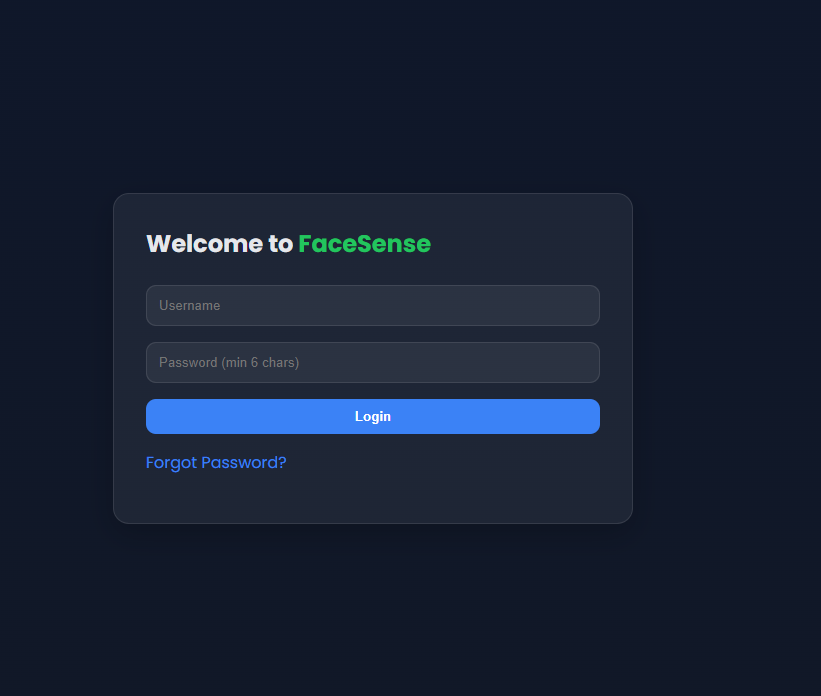

# 📘 FaceSense Attendance System

## 🚀 Overview

FaceSense is a **full-stack attendance management system** built with **FastAPI (backend)** and **React + Tailwind (frontend)**.
It supports:

* 👤 User registration & login (password or face recognition)
* 🖥 Admin panel for adding users (with face capture from webcam)
* 📢 Slack & Microsoft Teams **webhook integrations** for attendance alerts
* ✅ Attendance check-in & check-out with real-time notifications

---

## 🛠 Tech Stack

* **Backend:** FastAPI, SQLAlchemy, SQLite/Postgres, JWT auth
* **Frontend:** React, Vite, Tailwind CSS
* **Notifications:** Slack & Microsoft Teams webhooks
* **Authentication:** JWT tokens
* **Face Capture:** Webcam snapshot → base64 → backend

---

## 📂 Project Structure

```
facesense/
│
├── backend/
│   ├── app/
│   │   ├── api/              # FastAPI routers
│   │   ├── models/           # SQLAlchemy models
│   │   ├── utils/            # Utilities
│   │   ├── db/               # Database config
│   │   └── main.py           # FastAPI entry point
│   └── requirements.txt
│
├── frontend/
│   ├── src/
│   │   ├── pages/
│   │   ├── App.jsx
│   │   └── main.jsx
│   └── package.json
│
└── README.md
```

---

## ⚙️ Backend Setup

```bash
cd backend
python -m venv .venv
source .venv/bin/activate  # or .venv\Scripts\activate on Windows
pip install -r requirements.txt
uvicorn app.main:app --reload --host 127.0.0.1 --port 8000
```

Now open Swagger docs:
👉 [http://127.0.0.1:8000/docs](http://127.0.0.1:8000/docs)

---

## 🌐 Frontend Setup

```bash
cd frontend
npm install
npm run dev
```

App runs at 👉 [http://localhost:5173](http://localhost:5173)

Create `.env` in `frontend/`:

```
VITE_API_URL=http://127.0.0.1:8000
```

---

## 🔑 Default Admin Login

```
Username: admin
Password: admin123
```

---

## ✨ Features

### 👤 User Management

* Admin can **add new users** with name, email, student ID, and face capture.

### 👁️ Face Login

* Users can sign in using webcam snapshot.

### ✅ Attendance Tracking

* Students check-in/out → event stored in DB with timestamp.

### 📢 Slack/Teams Notifications

* Each attendance event automatically posts to Slack/Teams channels.

---

## 📸 Screenshots

### 🔐 Login Page



### 👁️ Face Login


### ➕ Admin Add User


### 🔔 Admin Integrations


### ✅ Slack Alert Example


---

## 🔧 API Examples

### Add Integration

```
PUT /api/settings/integrations
{
  "slack_webhook": "https://hooks.slack.com/services/XXX/YYY/ZZZ",
  "teams_webhook": "https://outlook.office.com/webhook/..."
}
```

### Attendance Event

```
POST /api/attendance/check
{
  "student_id": "VU23-001",
  "event": "checkin"
}
```

---

## 🚀 Future Improvements

* Real-time admin dashboard with live attendance feed
* Support multiple Slack/Teams channels
* Rich Slack/Teams cards with course & location info
* ML-powered face verification

---

## 📝 License

MIT License — free to use and modify.

---


